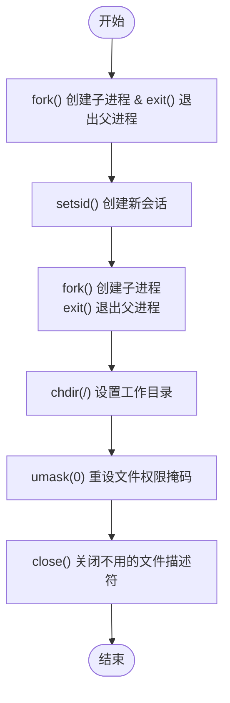

# Process management 

## Chapter 8 Labs 

## Daemon Process 

## Purpose 
Familar with how linux create daemon process and use it. 

## Lab requirement
(1) write user program to create daemon process. 
(2) This daemon process check out whether is Oops error in log every 5 sec.

## Daemon building process



1. fork() to create a child process, and let the parent process exit

This is the first step in creating a daemon process. Since a daemon process must detach from the controlling terminal, once the parent exits, it appears in the shell that the program has already finished. However, the child process continues execution in the background, giving the illusion that the process has detached from the terminal and allowing the user to continue running other commands.

2. Call setsid() in the child process to create a new session

After the fork, the child process inherits the session, process group, and controlling terminal of its parent. Even though the parent has exited, these attributes are still tied to the child. By calling setsid(), the process becomes fully independent, starting a new session, becoming the session leader, and detaching from the controlling terminal.

3. fork() again and let the parent exit

At this point, the process is already a session leader without a controlling terminal. However, a session leader can still potentially acquire a new controlling terminal. To prevent this, the process forks again, and the parent exits. The second child process is not a session leader, which guarantees that it cannot acquire a controlling terminal.

4. Call chdir() to change the working directory to "/"

By default, the child process inherits the working directory of the parent. If this directory is on a mounted filesystem (e.g., /mnt/usb), that filesystem cannot be unmounted while the daemon is running. To avoid such issues, the common practice is to change the working directory to /. This ensures that the daemon will not block unmount operations. Alternatively, the working directory can be changed to another safe path, such as /tmp, depending on application needs.

5. Call umask(0) to reset the file mode creation mask

A file mode creation mask defines which permission bits will be masked when new files are created. Since the child inherits the parent’s umask, it may impose unexpected restrictions on file permissions. Resetting the mask with umask(0) ensures the daemon has maximum flexibility when creating files, and permissions can be explicitly controlled by the program as needed.

6. Close any inherited file descriptors that are not needed

Like the umask, file descriptors are also inherited from the parent. These open file descriptors may never be used by the daemon but still consume system resources and may prevent filesystems from being unmounted. After detaching from the terminal, the standard file descriptors 0 (stdin), 1 (stdout), and 2 (stderr) are no longer meaningful to the daemon, so they should be closed to free resources.

7. Implement proper daemon exit handling

When the user wants to stop a daemon, it is usually done with the kill command. Therefore, the daemon should implement proper signal handling logic to catch and process signals (e.g., SIGTERM) and perform necessary cleanup before exiting gracefully.

Daemon.c is sample code for create daemon process. It write timestamp every 60 sec.

## klogctl() 
klogctl function can read kernel ring buffer. Read the kernel message.
klogctl.c is sample code for reading kernel ring buffer.

## oopswatchd
Oopswatchd is an answer. Create daemon process and use klogctl to read kernel ring buffer, and then parse Oops, if exit, store message to log file.

simulate Oops. Write message to kernel ring buffer through /dev/kmesg
```bash
sudo sh -c 'echo " Oops: simulated kernel-level test message" > /dev/kmsg'
```
result in oops.png
